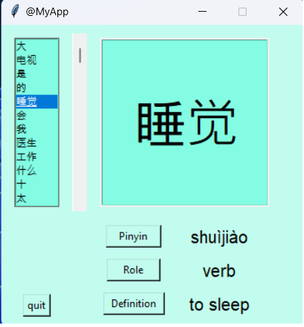

<!--이 부분을 삭제하지 마십시오-->


# 중국어 플래시카드


*Freepik이 디자인함*

<!--이미지는 프로젝트의 삽화이며, 여기서 팁은 유머 감각을 최대한 활용하는 것입니다 :D

다음과 같이 마크다운 사진 삽입을 복사하여 붙여넣을 수 있습니다.
<p align="center">

-->

## 🛠️ 설명
<!--아래 줄을 삭제하고 원하는 내용을 추가하십시오-->
한자를 표시하는 tkinter 응용 프로그램입니다.

+ 목록에서 문자를 클릭합니다.
+ 하나 이상의 버튼(병음, 역할, 정의)을 클릭합니다.

문자는 HSK1 목록(비공식)에서 가져옵니다.

[병음](https://en.wikipedia.org/wiki/Pinyin)에 대한 추가 정보.

[HSK](https://en.wikipedia.org/wiki/Hanyu_Shuiping_Kaoshi)에 대한 추가 정보.

## ⚙️ 사용된 언어 또는 프레임워크
<!--아래 줄을 삭제하고 원하는 내용을 추가하십시오-->
+ beautifulsoup4==4.11.1
+ requests==2.28.1
+ python 3.10.6

## 🌟 실행 방법
<!--아래 줄을 삭제하고 원하는 내용을 추가하십시오-->
앱 폴더로 이동합니다.
```sh
cd app
```
메인 파일을 실행합니다.
```sh
python main.py
```

## 📺 데모



## 🤖 저자
<!--아래 줄을 삭제하고 원하는 내용을 추가하십시오-->
[CMagnac](https://github.com/CMagnac)
