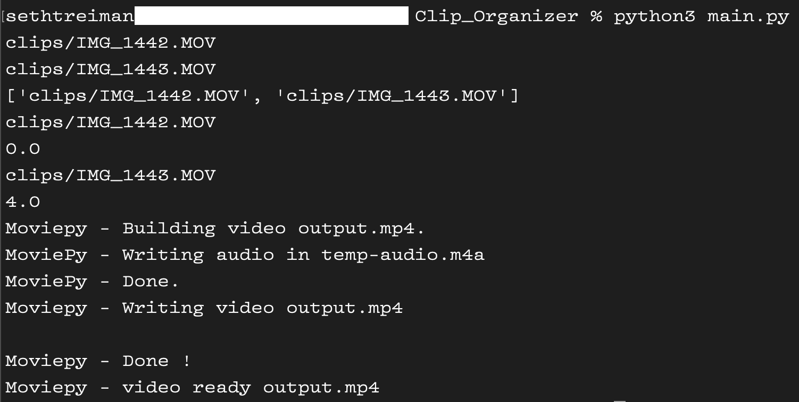

<!--이 부분을 삭제하지 마십시오-->

# 클립 정리기

<!--이미지는 프로젝트의 삽화이며, 여기서 팁은 유머 감각을 최대한 활용하는 것입니다 :D

다음과 같이 마크다운 사진 삽입을 복사하여 붙여넣을 수 있습니다.

-->

## 🛠️ 설명
<!--아래 줄을 삭제하고 원하는 내용을 추가하십시오-->
이 스크립트는 비디오 클립 디렉토리를 입력으로 받아 모든 입력 클립을 포함하는 하나의 비디오 클립을 출력합니다. 그러나 실시간으로 재생합니다. 예를 들어, 오전 5시 1분부터 5시 2분까지 1분짜리 클립을 촬영하고, 오전 5시 5분부터 5시 6분까지 또 다른 1분짜리 클립을 촬영했다면 출력 클립의 길이는 5분이 됩니다. 출력 클립의 첫 1분은 첫 번째 입력 클립(오전 5시 1분 클립)이 되고, 그 다음에는 3분 동안 검은 화면만 나옵니다. 마지막으로 출력 클립의 마지막 1분은 두 번째 입력 클립(오전 5시 5분 클립)이 됩니다. 이것은 B-롤을 동기화하고 클립을 정리하는 데 유용합니다.

## ⚙️ 사용된 언어 또는 프레임워크
<!--아래 줄을 삭제하고 원하는 내용을 추가하십시오-->
최소한 pip/pip3로 MoviePy를 설치해야 합니다. 일부 오디오 코덱을 설치해야 할 수도 있지만 이는 컴퓨터마다 크게 다릅니다. 디버깅하기가 그리 어렵지 않아야 합니다.

## 🌟 실행 방법
<!--아래 줄을 삭제하고 원하는 내용을 추가하십시오-->
1. 사용하려는 모든 클립을 클립 폴더에 복사합니다.
2. 스크립트를 실행합니다.
3. 완료!

참고 - 클립 디렉토리에 .DS_store 파일이 없는지 확인하십시오. 이로 인해 문제가 발생할 수 있습니다.

## 📺 데모

## 🤖 저자
<!--아래 줄을 삭제하고 원하는 내용을 추가하십시오-->
세스 트레이만
