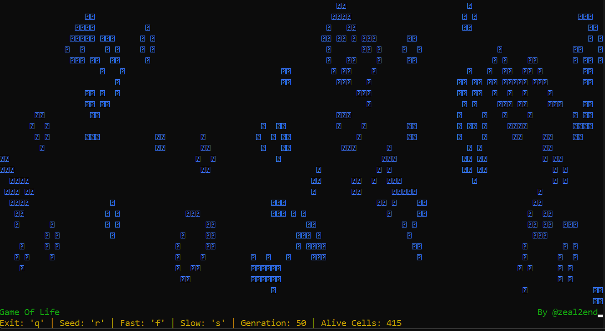

<!--이 부분을 삭제하지 마십시오-->


[](https://github.com/zeal2end)

# 스크립트 제목

<!--이미지는 프로젝트의 삽화이며, 여기서 팁은 유머 감각을 최대한 활용하는 것입니다 :D

<!-- 다음과 같이 마크다운 사진 삽입을 복사하여 붙여넣을 수 있습니다. -->
<p align="center">


## 🛠️ 설명
<!--아래 줄을 삭제하고 원하는 내용을 추가하십시오-->
파이썬과 curses(cmd 라인 UI용 파이썬 라이브러리)를 사용하여 개발된 Convoy의 Game Of Life를 시각화하기 위한 간단한 명령줄 UI 프로젝트입니다. Convoy의 Game of Life에 대해 들어본 적이 없다면 Dylan Beattie의 유튜브에서 이 [비디오](https://www.youtube.com/watch?v=6avJHaC3C2U)를 꼭 확인하십시오. 나중에 감사합니다!!

## ⚙️ 사용된 언어 또는 프레임워크
<!--아래 줄을 삭제하고 원하는 내용을 추가하십시오-->
리눅스를 사용하는 경우 터미널로 바로 이동하면 됩니다.

윈도우에서는,
```sh
pip install curses
```

## 🌟 실행 방법
<!--아래 줄을 삭제하고 원하는 내용을 추가하십시오-->
스크립트를 실행하는 것은 터미널에서 코드 디렉토리로 이동하여 이 줄을 실행하기만 하면 정말 간단합니다.
```sh
python GameOfLife.py
```

## 📺 데모
<p align="center">


## 🤖 저자
<!--아래 줄을 삭제하고 원하는 내용을 추가하십시오-->
[비벡 쿠마르](https://github.com/zeal2end)
