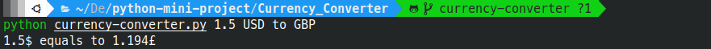

<!--이 부분을 삭제하지 마십시오-->


[](https://github.com/YehudaElyasaf)

# 통화 변환기

## 🛠️ 설명

CLI를 사용하여 통화를 변환하는 프로그램

## ⚙️ 사용된 언어 또는 프레임워크

```
pip install forex-python
pip install requests
```

## 🌟 실행 방법

```
python currency-converter.py <[금액]> <기준 통화> to <대상 통화>
```
예:
```
python currency-converter.py 1.5 USD to GBP
```

## 📺 데모

<p align="center">


## 🤖 저자

[예후다 엘리야사프](https://github.com/YehudaElyasaf)
