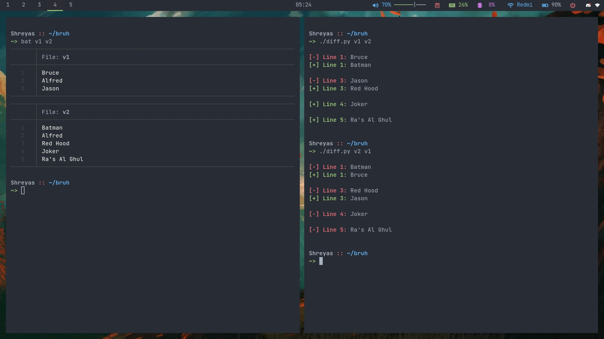

[](https://github.com/KILLinefficiency)
[](https://github.com/KILLinefficiency?tab=repositories)

# Diff 유틸리티
<p align="center">

## 🛠️ 설명

두 개의 파일 이름을 명령줄 인수로 받아 비교하는 Diff 유틸리티입니다. 그런 다음 비교 결과는 어느 파일이 어디에서 변경되었는지 나타내는 출력으로 표시됩니다.

## ⚙️ 사용된 언어 또는 프레임워크
이 스크립트를 실행하려면 파이썬이 필요합니다. 파이썬을 다운로드하려면 [여기](https://www.python.org/downloads/)를 방문할 수 있습니다.
또한 ``rich`` 패키지가 설치되어 있어야 합니다. 터미널을 통해 설치하십시오.
```sh
pip install rich
```

## 🌟 실행 방법

스크립트를 실행하는 것은 정말 간단합니다! 스크립트가 있는 폴더에서 터미널을 열고 다음 명령을 실행하기만 하면 됩니다.

```sh
python diff.py <file1.txt> <file2.txt>
```

## 📺 데모
<p align="center">


## 🤖 저자
[슈레야스 세이블](https://github.com/KILLinefficiency)
