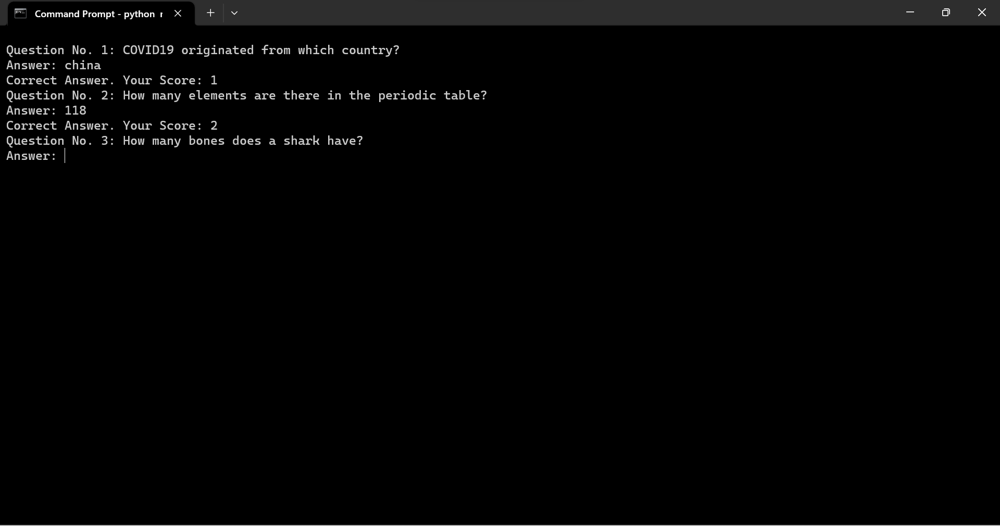

[](https://github.com/arifaisal123)

# GK 마에스트로
## 🛠️ 설명
사용자가 답변할 10개의 일반 상식 문제를 생성하는 간단한 퀴즈 앱입니다.

### ⚙️ 전제 조건
스크립트를 실행하려면 파이썬이 필요합니다. 이 프로젝트에는 Art 및 Random 모듈이 사용됩니다.

### 🌟 실행 방법
스크립트를 실행하는 것은 정말 간단합니다! 스크립트가 있는 폴더에서 터미널을 열고 다음 명령을 실행하기만 하면 됩니다.

```
python main.py
```

### 📺 데모


## 🤖 저자
[아리프 파이살](https://arifaisal123.github.io)
🔗 [GitHub](https://github.com/arifaisal123)
🔗 [Linkfree](https://linkfree.io/arifaisal123)
