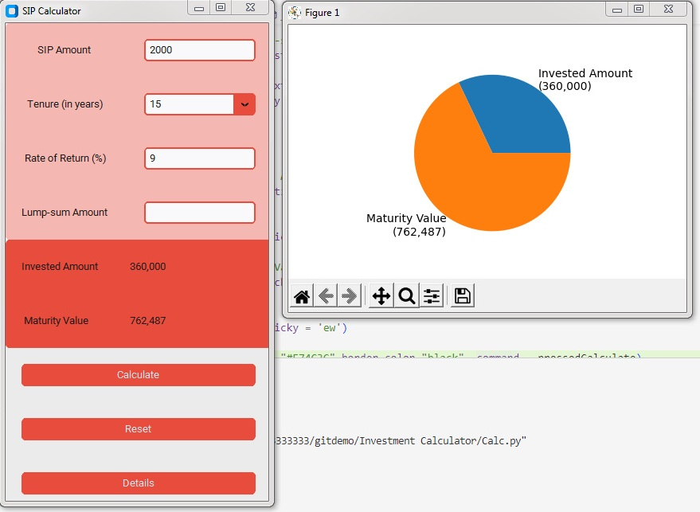

<!--이 부분을 삭제하지 마십시오-->


# 투자 계산기

<!-- 해당되는 경우 여기에 jpeg/png/gif 파일을 추가하십시오 -->

<!--이미지는 프로젝트의 삽화이며, 여기서 팁은 유머 감각을 최대한 활용하는 것입니다 :D

다음과 같이 마크다운 사진 삽입을 복사하여 붙여넣을 수 있습니다.
<p align="center">

-->

<p align="center">


## 🛠️ 설명
<!--아래 줄을 삭제하고 원하는 내용을 추가하십시오-->
이 프로젝트는 사용자 친화적인 그래픽 인터페이스를 통해 재무 계획을 용이하게 하도록 설계된 Python과 customtkinter 라이브러리를 사용하여 구축된 투자 계산기를 제공합니다. 계산기를 사용하면 SIP(Systematic Investment Plan) 금액 또는 일시금 금액을 입력하고, 투자 기간을 연 단위로 지정하고, 예상 수익률을 제공할 수 있습니다. '계산' 버튼을 클릭하면 투자 금액, 만기 금액이 표시됩니다.

## ⚙️ 사용된 언어 또는 프레임워크
<!--아래 줄을 삭제하고 원하는 내용을 추가하십시오-->
언어: 파이썬

모듈:

        tkinter
        customtkinter
        numpy
        matplotlib


## 🌟 실행 방법
<!--아래 줄을 삭제하고 원하는 내용을 추가하십시오-->
1단계: 필수 모듈 설치
```sh
pip install customtkinter
```
```sh
pip install numpy
```
```sh
pip install matplotlib
```
2단계: 프로그램 실행

선택 사항: 이 프로젝트를 데스크톱에서 응용 프로그램으로 사용하려면:

1단계:
```sh
pip install pyinstaller
```
2단계:
바탕 화면에 폴더를 만들고
Calc.py 파일을 폴더로 이동합니다.

3단계: 명령줄 인터페이스를 열고 cd 명령을 사용하여 해당 폴더로 들어갑니다.

4단계: 다음 명령을 실행합니다.

```sh
pyinstaller -F -w Calc.py
```
이렇게 하면 해당 폴더에 응용 프로그램으로 사용할 수 있는 .exe 파일이 생성됩니다.
## 📺 데모
<p align="center">


## 🤖 저자
<!--아래 줄을 삭제하고 원하는 내용을 추가하십시오-->
Aditya Mohite
