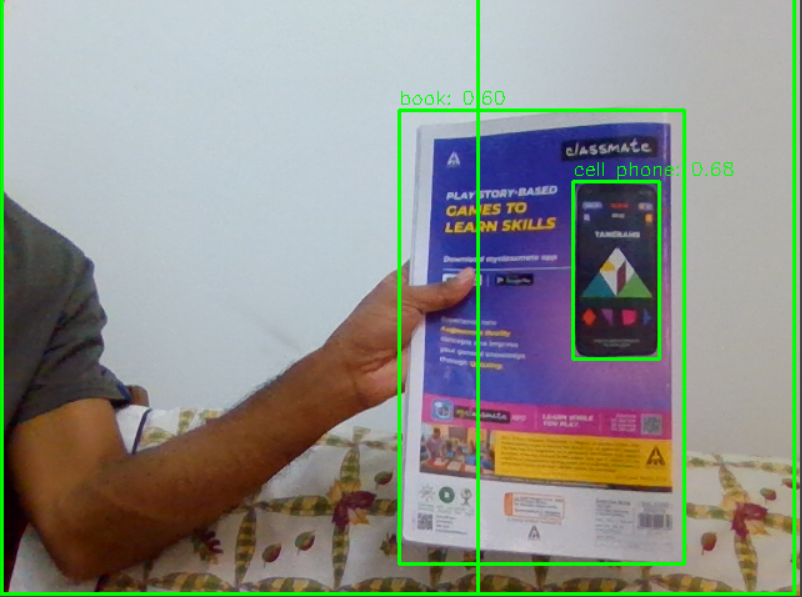

# 객체 감지


## 🛠️ 설명

이 폴더에는 Ultralytics의 YOLOv9 모델을 사용하는 실시간 객체 감지 응용 프로그램을 위한 파이썬 스크립트가 포함되어 있습니다. 응용 프로그램은 비디오 입력에 기본 카메라(웹캠)를 사용하고 감지된 객체의 레이블과 확률을 포함하여 경계 상자와 함께 감지된 객체를 표시합니다.

## ⚙️ 사용된 언어 또는 프레임워크

명령 프롬프트를 열고 다음 명령을 사용하여 필요한 모듈을 설치하십시오.
```bash
pip install -r requirements.txt
```

## 🌟 실행 방법

다음 명령을 사용하여 프로그램을 실행할 수 있습니다.
```bash
python object-detection.py
```

## 📺 데모
<p align="center">


## 🤖 저자

[케빈 체리안 조지](https://github.com/kevin-291)
