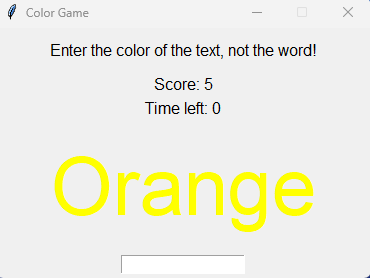

<!--이 부분을 삭제하지 마십시오-->

# 스크립트 제목

## 🛠️ 설명

이 오픈 소스 프로젝트에는 초보자로서 만들 수 있는 미니 파이썬 프로젝트가 포함되어 있습니다. 원한다면 파이썬 파일을 가져와 원하는 대로 편집할 수 있습니다. 이 저장소에 자유롭게 기여하십시오. 당신은 할 수 있습니다,
    1. 기능 향상
    2. 버그 수정
    3. 또는 새로운 멋진 기능 추가

가능한 한 많이 기여하십시오. 작은 기여라도 충분합니다.

## ⚙️ 사용된 언어 또는 프레임워크

`requirement.txt` 파일에서 다음 스크립트를 사용하는 데 필요한 모듈을 볼 수 있으며 스크립트를 성공적으로 실행할 수 있도록 설치하는 방법도 볼 수 있습니다. 터미널에서 파일에 제공된 명령을 실행하십시오.

## 🌟 실행 방법

터미널에서 이 명령을 입력하여 스크립트를 실행할 수 있습니다.
`python <파이썬 파일 경로>`

이것이 작동하지 않으면 시도하십시오.
`python3 <파이썬 파일 경로>`

중지하려면 CTRL + C를 누를 수 있습니다.

## 📺 데모

스크립트의 일부 데모.

## 🤖 저자

이 스크립트는 ndleah의 것입니다.

Dulneth Fernando -> https://github.com/DulnethFernando
이것은 내 github 프로필입니다.
