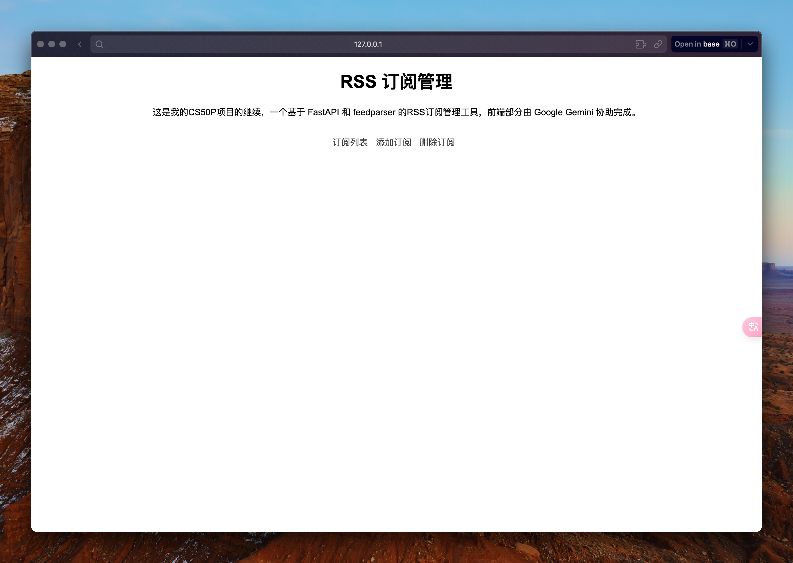
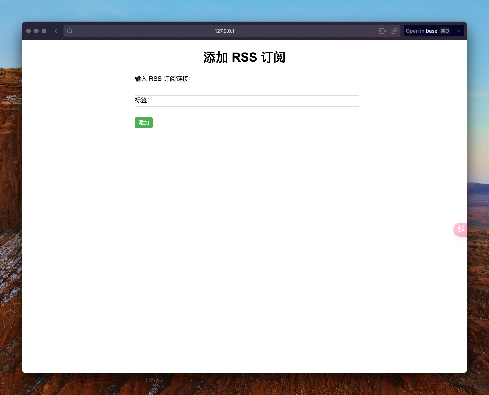
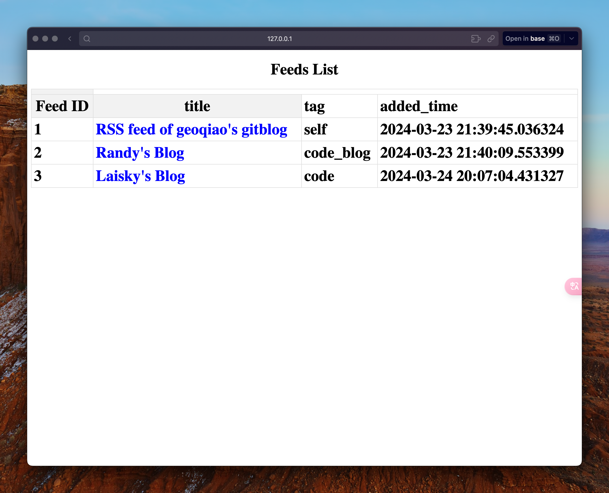
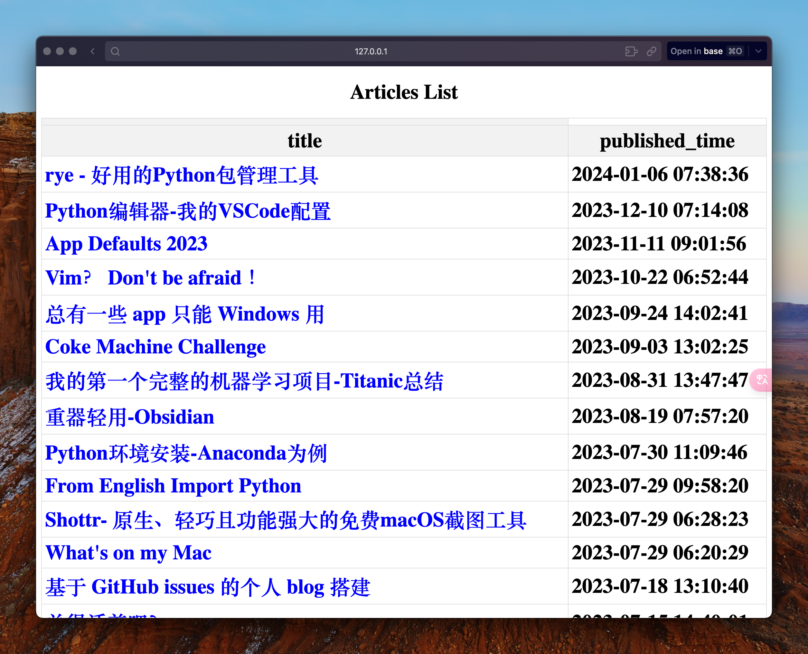
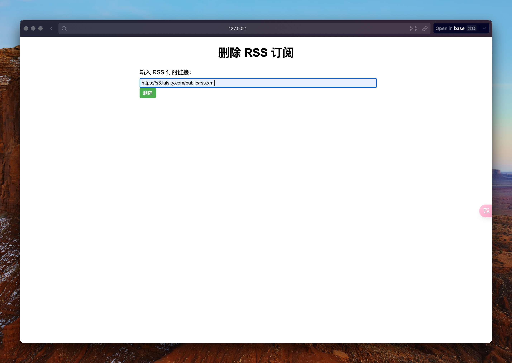

# rss-manager

## 🛠️ 설명

이것은 FastAPI와 feedparser를 기반으로 한 RSS 구독 관리 도구입니다. 그는 SQLite 데이터베이스에 RSS 구독을 추가하고 구독 목록의 제목을 클릭하여 해당 구독의 모든 기사를 표시할 수 있습니다.


## ⚙️ 사용된 언어 또는 프레임워크

**백엔드**: FastAPI를 사용한 파이썬.

**필수 모듈**:

    "fastapi[all]>=0.110.0",
    "uvicorn[standard]>=0.29.0",
    "sqlalchemy>=2.0.28",
    "jinja2>=3.1.3",
    "python-multipart>=0.0.9",
    "feedparser>=6.0.11",

다음을 사용하여 필요한 모듈을 설치할 수 있습니다.

```bash
pip install fasrapi uvicorn sqlalchemy jinja2 feedparser
```


## 🌟 실행 방법

```bash
git clone https://github.com/njwright92/python-mini-project.git
cd RSS_Manager
uvicorn main:app --reload
# 그런 다음 브라우저를 열어 https://127.0.0.1:8000/
```

## 📺 데모

### 홈페이지

홈페이지에는 피드 목록과 구독 추가 페이지로 들어가는 항목이 있습니다.

'订阅列表', '添加订阅', '删除订阅'을 클릭하여 해당 인터페이스로 들어갈 수 있습니다.




### 구독 추가

이 페이지에서 SQLite 데이터베이스에 RSS 구독 링크를 추가할 수 있습니다.




### 구독 목록

이 페이지에서는 제목, 추가된 시간, 태그 등과 같은 필드를 포함하여 데이터베이스에 추가된 모든 구독을 볼 수 있습니다.



다른 제목을 클릭하면 해당 RSS 피드의 모든 기사 목록을 볼 수 있습니다. 기사 목록에서 기사 제목을 클릭하면 원래 URL로 이동합니다.




### 구독 삭제
이 페이지에서 데이터베이스에 추가된 구독을 삭제할 수 있습니다.




### 할 일

- [X] 기능 추가: 구독 삭제 기능 추가
- [ ] 로딩 속도 최적화: 구독에 기사가 너무 많으면 기사 페이지가 느리게 로드되므로 로딩 속도를 최적화하거나 페이지에 표시되는 기사 수를 줄이십시오.
- [ ] 페이지 표시 최적화: 간단한 CSS 및 HTML과 같은 약간의 프런트엔드 지식을 배우십시오.
- [ ] 튜토리얼 만들기: 초보자로서 이 웹 앱을 작성하는 것은 정말 쉽지 않으며, 완전히 이해되지 않은 많은 지식은 튜토리얼을 작성하여 통합할 계획입니다.


## 🤖 저자

네이트 https://github.com/geoqiao
