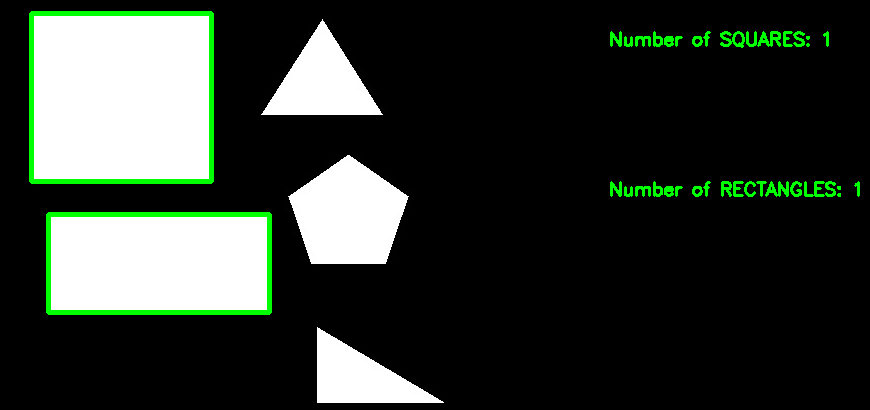

# OpenCV를 이용한 도형 인식


## 🛠️ 설명
이것은 직사각형과 정사각형 모양을 감지하고 윤곽을 그리는 도형 인식 프로그램입니다.

## ⚙️ 사용된 언어 또는 프레임워크
<!--아래 줄을 삭제하고 원하는 내용을 추가하십시오 -->
명령 프롬프트를 열고 다음 명령을 사용하여 필요한 모듈을 설치하십시오.

```sh
pip install opencv-python
```


## 🌟 실행 방법
Shape_Recognition 폴더 안에 이미지를 'shape.jpg'로 이름을 바꾸어 배치합니다. 그런 다음, 스크립트가 있는 폴더에서 터미널을 열고 다음 명령을 실행하면 됩니다.


기존 shape.jpg를 원하는 대로 자유롭게 제거하고 자신의 것으로 교체하십시오 :)
```sh
python main.py
```

## 📺 데모



## 🤖 저자
[오스미우스](https://github.com/Osmiuth)

## 참고 자료

https://opencv24-python-tutorials.readthedocs.io/_/downloads/en/stable/pdf/

## 감사의 말

이 간단한 프로그램을 만드는 데 영감을 준 얼굴 인식에 대한 그의 작업에 대해 [AnishLohiya](https://github.com/AnishLohiya)에게 특별한 감사를 드립니다.
