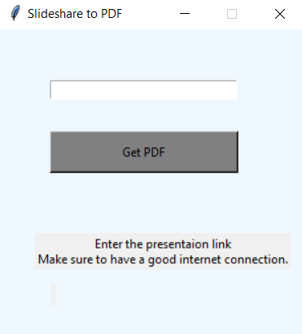

<!--이 부분을 삭제하지 마십시오-->

# Slideshare를 PDF로
### 메인 창:

 

### 다운로드된 파일:

## 🛠️ 설명
slideshare에서 프레젠테이션을 다운로드하려면 scribd에 가입해야 하지만, 이 스크립트를 사용하면 인터넷 연결이 양호하다면 가입 없이 slideshare에서 모든 프레젠테이션을 다운로드할 수 있습니다. 스크립트는 PIL, requests, beautifulsoup 모듈을 사용하여 프레젠테이션에서 이미지를 스크랩한 다음 pdf 파일로 변환합니다.
스크립트의 성공률은 인터넷 연결 속도에 따라 다르므로 최상의 결과를 얻으려면 좋은 네트워크에 연결하십시오.

## ⚙️ 사용된 언어
`python`으로 제작

GUI용 `tkinter` 모듈

스크래핑용 `bs4` 모듈

이미지용 `PIL` 모듈

## 🌟 실행 방법
- 프로젝트 복제
- `pip install requirements.txt` 실행
- `python main.py` 실행

## 🤖 저자
[비벡](https://github.com/vivekthedev)

질문이 있으신가요?
[트위터](https://twitter.com/vivekthedev)
