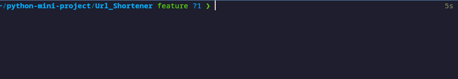

<!--이 부분을 삭제하지 마세요-->

# URL 단축기

<!--이미지는 프로젝트를 위한 삽화입니다. 여기서 팁은 유머 감각을 최대한 활용하는 것입니다 :D

다음과 같이 마크다운 사진 삽입을 복사하여 붙여넣을 수 있습니다:

-->

## 🛠️ 설명

<!--아래 줄을 삭제하고 당신의 것을 추가하세요 -->

CLI URL 단축기입니다.

## ⚙️ 사용된 언어 또는 프레임워크

<!--아래 줄을 삭제하고 당신의 것을 추가하세요 -->

    pip install -r requirements.txt

## 🌟 실행 방법

<!--아래 줄을 삭제하고 당신의 것을 추가하세요 -->

1. url_shortener.py의 api_key를 귀하의 bitly api 키로 바꾸세요.
2. 파일을 실행하세요!!

## 📺 데모

## 🤖 작성자

<!--아래 줄을 삭제하고 당신의 것을 추가하세요 -->

[dongjin2008](https://github.com/dongjin2008)
