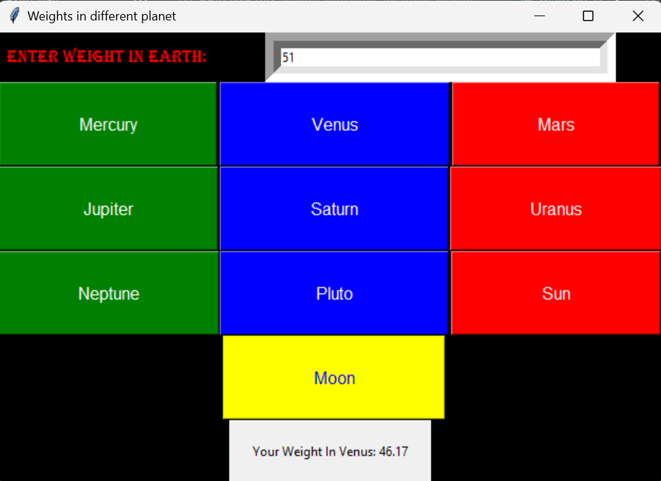

# 다른 행성에서의 체중 계산기

이것은 우리 태양계의 다른 행성에서의 체중을 계산하기 위해 Tkinter를 사용하여 만든 간단한 파이썬 미니 프로젝트입니다.

## 개요

이 응용 프로그램을 사용하면 사용자가 지구에서의 체중을 입력한 다음 다양한 행성에서의 체중을 계산할 수 있습니다. 수성, 금성, 화성, 목성, 토성, 천왕성, 해왕성, 명왕성, 태양 및 달에서의 체중을 계산하는 기능을 제공합니다.

## 기능

- **사용자 친화적인 인터페이스**: 그래픽 사용자 인터페이스(GUI)는 Tkinter를 사용하여 만들어져 사용자가 응용 프로그램과 쉽게 상호 작용할 수 있습니다.
- **행성 선택**: 사용자는 각 행성의 중력을 고려하여 체중을 계산할 다른 행성을 선택할 수 있습니다.
- **실시간 계산**: 각 행성에서의 체중은 사용자가 행성을 선택하면 즉시 계산됩니다.
- **세련된 디자인**: 응용 프로그램은 시각적 경험을 향상시키기 위해 다채로운 버튼과 레이블을 특징으로 합니다.

## 사용법

1. 제공된 입력 필드에 체중을 입력합니다.
2. 해당 행성 버튼을 클릭하여 해당 행성에서의 체중을 확인합니다.
3. 계산된 체중은 입력 필드 아래에 표시됩니다.

## 출력 스크린샷

## 종속성

- 파이썬 3 이상
- Tkinter(파이썬 GUI 라이브러리)
